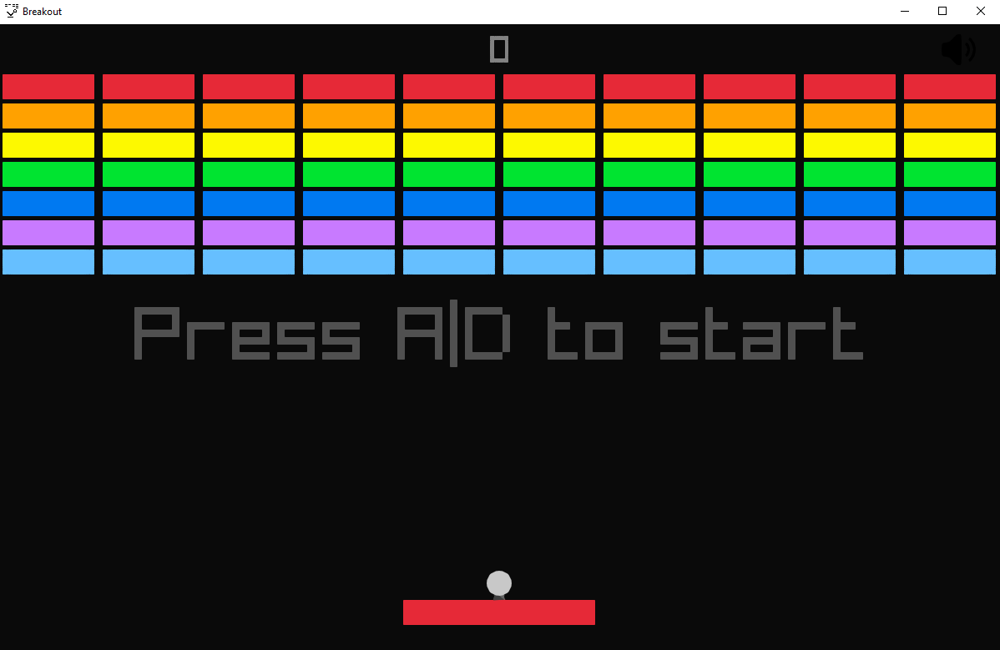

# Breakout
Welcome to Breakout, a classic arcade game! This version reintroduces the excitement of breaking bricks and maneuvering a paddle to keep the ball in play. Get ready for a challenging experience with enhanced gameplay mechanics. [Try the web build](https://cunterrainer.github.io/Breakout/)



# Controls
## Keyboard
- **A/D or left/right arrow:** Move the paddle horizontally.
- **Space:** Launch the ball at the start of the game or resume after a failed attempt.
- **R:** Reset the game.
- **L:** Reset the game including stats.
- **M:** Mute the audio.
- **X:** Render only the outlines of objects.
- **O:** Auto move the paddle.
- **U:** Auto restart after success or failure.
- **G:** Make the bottom a hitbox (Game can no longer be lost).
- **P:** Toggle the paddles hitbox.
- **B:** Show game stats (wins, fails, ball speed).
- **I:** Toggle increment ball speed when scored.
- **F:** Show FPS.
- **Q:** Limit FPS.
- **F3:** Show controlls
- **ESC:** Pause/resume the game.
- **. or ,:** Increase/Decrease fps limit.
- **W/A or Up/Down or 1/2:** Increase/Decrease the ball's speed.

## Controller
Here, the PS4 controller buttons are used as an example, but other controllers will work as well:
- **DPAD or Left Stick:** Move the paddle horizontally.
- **X:** Launch the ball at the start of the game or resume after a failed attempt.
- **△:** Reset the game.
- **□**: Mute the audio.
- **◯**: Render only the outlines of objects.
- **L1:** Show the speed of your ball.
- **R1:** Toggle increment ball speed when scored.
- **R2:** Show controlls
- **SHARE:** Show FPS.
- **OPTIONS:** Pause/resume the game.
- **DPAD Up/Down:**  Increase/Decrease the ball's speed.
- **Right Stick pressed:** Make the bottom a hitbox (Game can no longer be lost).
- **Left Stick pressed:** Toggle the paddles hitbox.

If you encounter issues with controller input, please verify that you have selected the correct controller, ensuring it corresponds to the first one assigned by your PC.

# Build Instructions
## Prerequisites
### Linux
Following libraries have to be installed and accessible to the current user:
- xorg (should contain:)
  - libx11
  - libxcursor
  - libxrandr
  - libxinerama
  - libxi

## Using premake
For the web assembly build, clone the repository then proceed [here](#build-webassembly).  
This project utilizes Premake as its build system, offering seamless integration with Visual Studio, Clang, and GCC. To set up the project, follow these steps:

## Clone the repository

``` bash
git clone https://github.com/pyvyx/Breakout.git
```
``` bash
cd Breakout
```

## Visual Studio

``` bash
vendor\premake5.exe vs2022
```
This should generate a .sln file

## Make

Windows:
``` bash
vendor\premake5.exe gmake2 [cc]
```

Linux:
``` bash
vendor/premake5linux gmake2 [cc]
```

macOS:
``` bash
vendor/premake5macos gmake2 [cc]
```

GCC should be the default compiler on Windows and Linux, macOS uses Clang by default, but you can explicitly specify it if you want.  
GCC:   --cc=gcc  
Clang: --cc=clang  
There are also other compilers available however building has only been tested with gcc, clang and msvc

### Build

``` bash
make [-j] config=<configuration>
```

### Build WebAssembly
There is already a precompiled build in docs, otherwise you have to build it yourself.
``` bash
make -f Makefile.Web [-j] config=<configuration>
```
If you don't like emscriptens default page you can use the provided `index.html` in `docs`.

Configurations:
 - debug_x86
 - debug_x64 (default, the same as just using `make`)
 - release_x86
 - release_x64

macOS:
 - debug_universal (default, the same as just using `make`)
 - release_universal

WebAssembly:
 - debug (default, the same as just using `make`)
 - release

`-j` flag utilises multi-threaded compilation

``` bash
make help
```
to get a list of all the available configurations

## Additional Information
For more details on Premake options, use the following commands:

Windows:
``` bash
vendor\premake5.exe --help
```

Linux:
``` bash
vendor/premake5linux --help
```

macOS:
``` bash
vendor/premake5macos --help
```

## Troubleshooting
If you experience linking errors on Linux, resolve them by adding the necessary libraries to `Snake/premake5.lua`. Ensure these libraries are added before the last line in the file:

``` lua
filter {}
```

For linking errors, use this example:
``` lua
filter "system:linux"
    links {
        "GL",
        "X11",
        "rt",
        "dl",
        "m"
    }
```

For missing include directories, use this example:
``` lua
filter "system:linux"
    links {
        "GL",
        "X11",
        "rt",
        "dl",
        "m"
    }

    includedirs {
        "src/",
        "include/
    }
```

Make sure to tailor these adjustments to accommodate any specific libraries or directories required for successful compilation on the Linux platform.